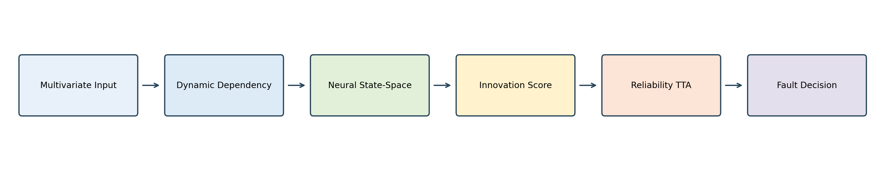

# DCSS-Power-Fault-Detection

Reference implementation of **DCSS**, a regime-dependent lagged dependency,
neural state-space, innovation-scoring, and reliability-constrained test-time
adaptation pipeline for multivariate power-system fault detection.



## Scope

This repository contains model and evaluation code only. It contains no raw
datasets, pretrained weights, checkpoints, experiment logs, or reported result
files. The learned graphs represent lagged directed predictive dependencies;
they are not claimed to identify interventional causal effects.

## Installation

```bash
python -m venv .venv
source .venv/bin/activate  # Windows: .venv\Scripts\activate
pip install -r requirements.txt
```

## Data format

Obtain a benchmark from its official source and create an external NPZ file:

```text
train:       float array [T_train, D], nominal training observations
test:        float array [T_test, D]
test_labels: integer array [T_test], optional until final evaluation
```

Do not place licensed data under version control. See
[`datasets/README.md`](datasets/README.md).

## Reproduction workflow

All paths and hyperparameters are controlled by YAML/CLI arguments.

```bash
python experiments/train.py --config configs/default.yaml --data /path/to/data.npz
python experiments/test.py --config configs/default.yaml --data /path/to/data.npz
python experiments/evaluate.py --scores results/test_scores.npz --data /path/to/data.npz
```

The training script fits normalization and dependency structures on the first
80% of nominal training data, uses the chronological final 20% for checkpoint
selection and threshold calibration, and never reads test labels. The test
script produces scores without labels. `evaluate.py` is the only entry point
that reads `test_labels`.

Shell wrappers are available in `scripts/train.sh` and `scripts/test.sh`.

## Default protocol

- window length 10, stride 1
- lag 2, top-3 lagged predictors per target, Ridge alpha 1
- latent dimension 32, GRU history dimension 128, dependency context 64
- Adam, learning rate `1e-4`, weight decay `1e-3`, 30 epochs
- checkpoint selected by minimum chronological validation loss
- train-normal Ledoit–Wolf innovation Mahalanobis score
- train median/MAD normalization and validation-normal q99 threshold
- no point adjustment, score reversal, or test-label threshold tuning

## License and data

Code is released under the MIT License. Dataset licenses remain with their
respective owners and may impose additional access restrictions.

